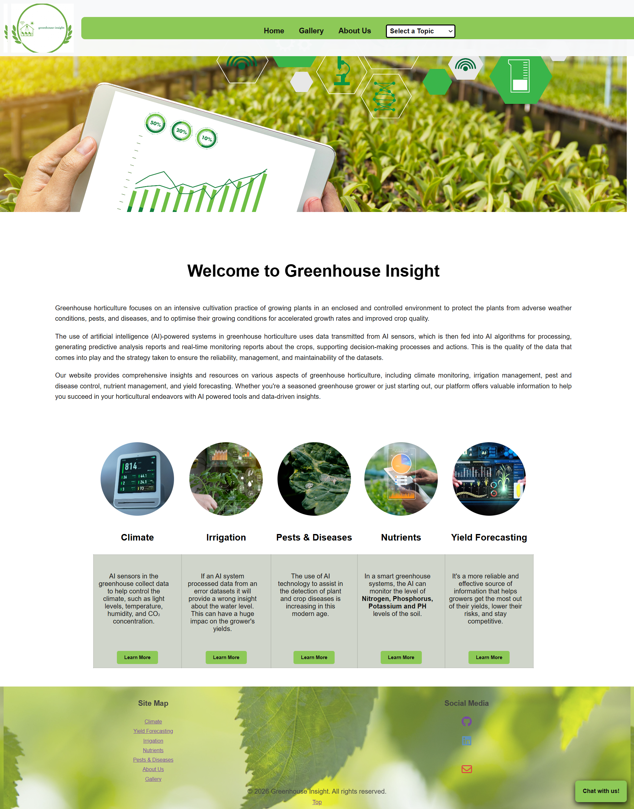

# Greenhouse Insight: AI-Powered Horticultural Monitoring & Analysis

### Project Website Homepage

The Greenhouse Insight platform is a data-driven web solution designed to modernize greenhouse management. The following is an example of the project's user interface, specifically the welcoming homepage which introduces the core mission and functionalities of the platform.

*(Image shows the 'Welcome to Greenhouse Insight' homepage, introducing the concepts of intensive cultivation, AI integration, and core monitoring features.)*

---

## 1. Project Overview

**Greenhouse Insight** aims to transition traditional enclosed growing practices into precision agriculture models. The project focuses on leveraging the "intensive cultivation practice" of greenhouse horticulture, where crops grow in controlled environments. By protecting plants from "adverse weather conditions, pests, and diseases," the platform seeks to "optimise their growing conditions for accelerated growth rates and improved crop quality."

### Background: The Role of AI in Agriculture

The second paragraph of the homepage details the foundation of the project's logic:

> "The use of artificial intelligence (AI)-powered systems in greenhouse horticulture uses data transmitted from AI sensors, which is then fed into AI algorithms for processing, generating predictive analysis reports and real-time monitoring reports about the crops, supporting decision-making processes and actions."

This project implements that strategy by taking raw dataset information (e.g., CSV sensor logs) and transforming it into real-time monitoring visualizations, emphasizing the "quality of the data... management, and maintainability of the datasets."

## 2. Core Features & Functionality

The platform is built to provide "comprehensive insights and resources" across a wide spectrum of horticultural needs. Based on the data available in the background datasets, the following features are supported:

### A. Climate Monitoring
The core function of the dashboard. This feature allows growers to monitor the enclosed environment of the greenhouse. The homepage text highlights monitoring for:
* **Temperature (°C)**
* **Humidity (%)**
* **Light Intensity** (e.g., Solar Radiation)

### B. Analytical Reports
By processing sensor data, the platform generates **predictive analysis reports** and **real-time monitoring reports**. These insights directly support "decision-making processes and actions" for the grower.

### C. Comprehensive Grower Resources
Beyond raw data display, the platform aims to be a hub for managing multiple greenhouse operations:
* **Irrigation Management:** Using soil moisture and environmental data to optimize watering.
* **Pest and Disease Control:** Tracking environmental conditions that may lead to outbreaks.
* **Nutrient Management:** Long-term data tracking for fertilizer optimization.
* **Yield Forecasting:** Predicting crop output based on historical and current climate trends.

## 3. Usage & Target Audience

As noted on the homepage, this platform is designed for a broad user base:
* **Seasoned Greenhouse Growers:** Who need to move from manual checks to data-driven AI solutions.
* **New Horticulturalists:** Who can utilize the predictive analytics to learn about optimal growing conditions and importances of good data.

### Getting Started

The implementation files included in this repository allow you to run the project.

1.  Open the `homePage.html` file in a browser (requires a local server, e.g., VS Code's **Live Server** extension, to fetch the CSV data).
2.  The application will automatically load the configured sensor dataset (e.g., `greenHouse_weather_2025_data.csv`).
3.  Navigate through the different Topics (Temperature, Humidity, etc.) to view the visualizations generated from that data.

---

*NOTE: The dataset used by this platform contains simulated but realistic values for educational and research purposes.*